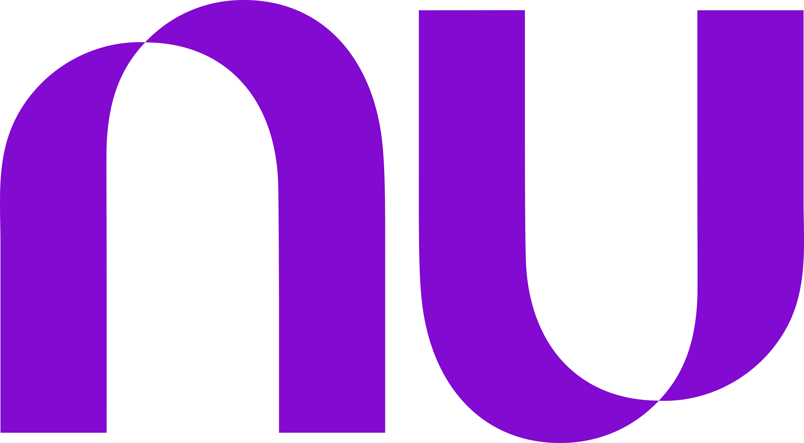

 

## :pushpin: Início

      

  <a href ="#rocket-o-projeto">Projeto</a>  •
  <a href ="#dart-proposta">Proposta</a>  •
  <a href ="#bulb-metodologia-utilizada">Metodologia</a>  •
  <a href ="#hourglass_flowing_sand-planejamento-de-aulas">Planejamento</a>  •
  <a href ="#calendar-os-sprints">Entregas</a>  •
  <a href ="#camera_flash-as-versões-finais-dos-projetos">Versões das entregas</a>  •
  <a href ="#computer-tecnologias-utilizadas">Tecnologias</a>  •
  <a href ="#bar_chart-backlog-do-projeto">Backlog</a>  •
  

<h1 align="center">
  Curso de formação em tecnologia.
<h1 align="center">
 
      
## :rocket: O Projeto

* Qualificação pra pessoas interessadas em aprender Front-End.
 

## :dart: Proposta

* Desenvolvimento e capacitação de pessoas com renda em hard skills como o  desenvolvimento web (com CS e JavaScript) e de FrontEnd (com design thinking, UX, CSS, HTML, entre outros), complementado também pela fomração em soft skills, gestão de projetos e diversidade.  

<a href ="#pushpin-início">Voltar ao início</a>  
 

## :bulb: Metodologia Utilizada

* **Metodologia Ágil:** Framework [Scrum](https://www.desenvolvimentoagil.com.br/scrum/)

<a href ="#pushpin-início">Voltar ao início</a>  
  
      
## :hourglass_flowing_sand: Planejamento de Aulas

|Unidades Curriculares |Quantidade de aulas|Início| Término|
|-------- |-------- |-------- |-------- | 
|Projeto de vida|11|20/03/2023|14/04/2023|
|Introdução ao desenvolvimento web|7|20/03/202|31/03/202|
|Design thinking, ux e metodologias ágeis.|10|10/04/2023|28/04/2023|
|Diversidade|8|17/04/2023|19/05/2023|
|HTML, CSS e Bootstrap|10|24/04/2023|12/05/2023|
|JavaScript|12|15/05/2023|26/05/2023|
|Técnicas e ferramentas para gestão de projetos e produtos|5|22/05/2023|23/06/2023| 
|React|16|05/06/2023|30/06/2023| 
|Inteligência emocional|-|8|-|-|
     
<a href ="#pushpin-início">Voltar ao início</a>  
 

## :calendar: Os Sprints

☑️ SPRINT 1 ([Link da Pasta](https://github.com/institutoNuDescomplica/Projeto-de-vida)): Concluído :heavy_check_mark:

☑️ SPRINT 2 ([Link da Pasta](https://github.com/institutoNuDescomplica/Introducao-ao-desenvolvimento-Web)): Concluído :heavy_check_mark: 

☑️ SPRINT 3 ([Link da Pasta](https://github.com/institutoNuDescomplica/Design-thinking-ux-e-metodologias-ageis)): A fazer 

☑️ SPRINT 4 ([Link da Pasta](https://github.com/institutoNuDescomplica/Diversidade)): A fazer 

☑️ SPRINT 5 ([Link da Pasta](https://github.com/institutoNuDescomplica/HTML-CSS-e-Bootstrap)): A fazer 

☑️ SPRINT 6 ([Link da Pasta](https://github.com/institutoNuDescomplica/JavaScript)): A fazer 

☑️ SPRINT 7 ([Link da Pasta](https://github.com/institutoNuDescomplica/Tecnicas-e-ferramentas-para-gestao-de-projetos-e-produtos)): A fazer 

☑️ SPRINT 8 ([Link da Pasta](https://github.com/institutoNuDescomplica/React)): A fazer 

☑️ SPRINT 9 ([Link da Pasta](https://github.com/institutoNuDescomplica/Inteligencia-emocional)): A fazer 

<a href ="#pushpin-início">Voltar ao início</a>  
  

## :camera_flash: As Versões Finais dos Projetos

☑️ 1 ENTREGA: [colocar endereço do site aqui](colocar endereço do site aqui) :heavy_check_mark:

<a href ="#pushpin-início">Voltar ao início</a>  
  

## :computer: Tecnologias Utilizadas

* **Front-end:** HTML, CSS, Bootstrap, React.js e JavaScript;   
* **Versionamento:** GIT e GitHub desktop;           
* **Design:** Illustrator, Photoshop, Corel Draw;
* **Planejamento:** Planner, Project Libre, PowerPlataform;
* **Comunicação:** Discord, Whatsapp, Teams.

<a href ="#pushpin-início">Voltar ao início</a>  
      
      
## :bar_chart: Backlog do Projeto

 

      

<a href ="#pushpin-início">Voltar ao início</a>  
   
 
## :mortar_board: Colaborador

|Nome|Função|Linkedin|GitHub|Avatar|
| -------- |-------- |-------- |-------- |-------- |
|**Renato Wessner**|Estudante| [@LinkedIn](https://www.linkedin.com/in/renato-wessmer-dev-gpti/)|[@GitHub](https://github.com/renato-wessmer)||

<a href ="#pushpin-início">Voltar ao início</a>  
 

<h1 align="center"> </h1>  
<h1 align="center"> </h1> 
